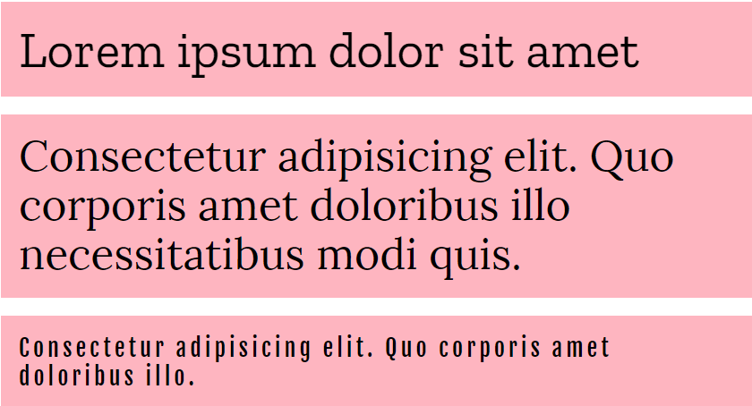

# JQuery textShake v0.1
JQuery plugin that provides some animations to show text



[Watch the demo included in the repo](https://htmlpreview.github.io/?https://raw.githubusercontent.com/carloscabo/jquery-text-shake/master/index.html)

# Requirements

- JQuery 1.7+

# Usage
```javascript
$(element).textShake(); // Default options
```

Available options.

```javascript
$(element).textShake({
  letter_delay: 60,
  split_words: 8,
  autoplay: true,
  fix_heght: false,
  onComplete: function( obj ) {
    console.log(obj);
  }
});
```

# Launch effec ptogramatically

```javascript
// Start efect with autoplay set to false
$(element).textShake({
  autoplay: false
});
```

Launch the effect callin  `.play()` on the element:

```javascript
  $(element).textShake('play');
```

# Changelog

